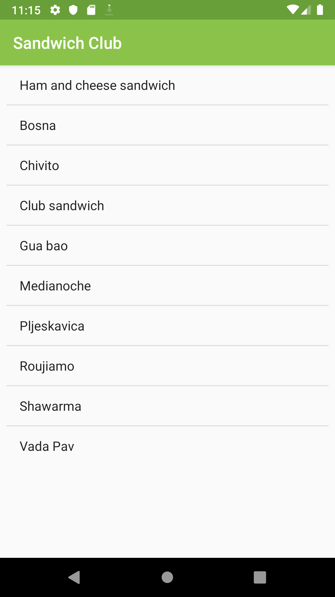
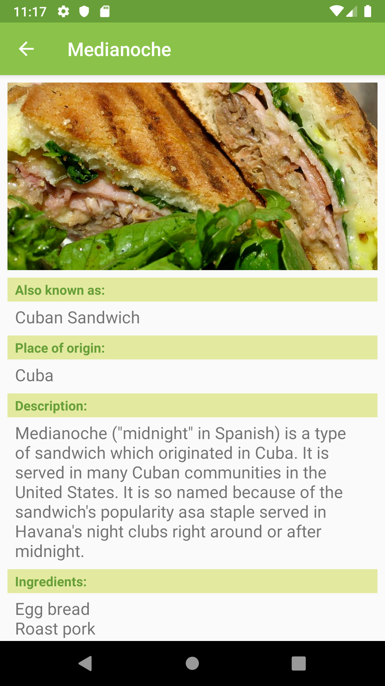

# Sandwich Club Project

## Project Overview

**Sandwich Club** app shows list of sandwiches and when sandwitch is selected more detailed description is displayed. The app layout is populated from data received as JSON. 
The app is part of the Udacity course: **Android Developer Nanodegree Program**.

## Why this Project

Building a layout and populating its fields from data received as JSON is a common task for Android Developers. Although JSON parsing is usually done using libraries, writing the JSON parsing for this project helps to better understand how it is processed.

## Project requirements
- JSON data is parsed correctly to a Sandwich object in JsonUtils
- JSON is parsed without using 3rd party libraries
- DetailActivity shows all Sandwich details correctly
- Detail layout includes a ScrollView so all the details are visible in small screen devices
- Sandwich details are shown in a sensible layout. For example, ingredients appear next to the ingredients label

## Screenshots

